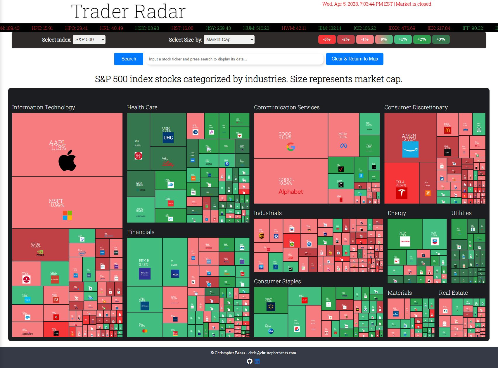
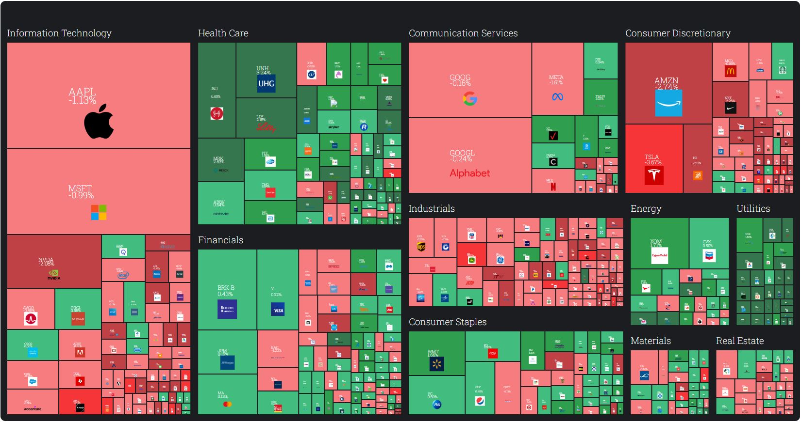
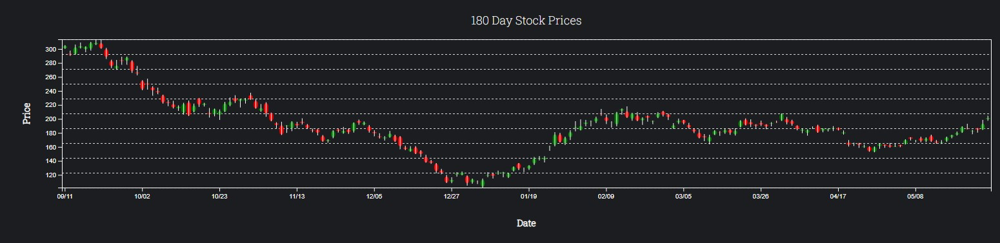
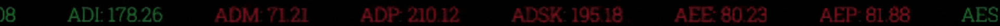
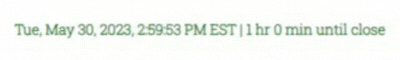
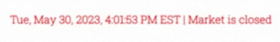

<h1 id="title" style="color: white; font-size: 65px; font-family: 'Roboto Slab', serif; margin-left: 15px; font-weight: 100;">
    <a href="https://www.traderradar.net/" style="text-decoration: none; color: inherit;">Trader Radar</a>
</h1>

Trader Radar is a visual and interactive representation of how various stocks or financial instruments are performing in the market. It combines a stock heatmap, a stock search function, a candlestick chart, live market clock, and stock ticker tape to provide valuable insights and aid in decision-making.

 

---------------------

# Technologies, Libraries, APIs

## **Financial Data APIs**

### [Financial Modeling Prep](https://site.financialmodelingprep.com/developer/docs/)

| **API**                     | **Feature** | **Info**                                                                                                                           |
|-----------------------------|-------------|------------------------------------------------------------------------------------------------------------------------------------|
| [List of S&P 500 Companies](https://site.financialmodelingprep.com/developer/docs/list-of-sp-500-companies-api/)   | Heatmap / Ticker   | It returns all S&P 500 constituents.                                                                                               |
| [List of Dow Jones Companies](https://site.financialmodelingprep.com/developer/docs/list-of-dow-companies-api/) | Heatmap / Ticker    | Returns Companies in the Dow Jones, such as Honeywell and Home Depot.                                                              |
| [List of NASDAQ Companies](https://site.financialmodelingprep.com/developer/docs/list-of-nasdaq-companies-api/)    | Heatmap / Ticker    | Returns Companies in the Nasdaq 100, such as DocuSign and Zoom.                                                                    |
| [Current Stock Data](https://site.financialmodelingprep.com/developer/docs/stock-api/)          | Heatmap / Ticker    | Obtains real-time stock market quotes                                                                                              |
| [Companiy Stats](https://site.financialmodelingprep.com/developer/docs/companies-key-stats-free-api/)              | Search      | Access data for a company such as 52 week high, 52 week low, market capitalization, and key stats to understand a company finances. |
| [Stock News](https://site.financialmodelingprep.com/developer/docs/stock-news-api/)                 | Search      | It returns the most recent news with parameters like images or urls of the original article.                                         |
| [Historical Stock Data](https://site.financialmodelingprep.com/developer/docs/historical-stock-data-free-api/#Historical-Daily-Prices)       | Search      | Provides access to historical prices that can be used to create charts.                                                            |
|                             |             |                                                                                                                                    |

## **Charting libraries**

| **Chart**         | **Library**                                          | **Feature**       | **Info**                                                                                                                                                                                                                    |
|-------------------|------------------------------------------------------|-------------------|-----------------------------------------------------------------------------------------------------------------------------------------------------------------------------------------------------------------------------|
| Treemap           | [D3](https://observablehq.com/@d3/treemap)           | Heatmap           | A treemap chart visually represents hierarchical data using nested rectangles, where the size and color of each rectangle correspond to different data attributes.                                                          |
| Candlestick | [D3](https://observablehq.com/@d3/candlestick-chart) | Candlestick Chart | A candlestick chart displays the opening, closing, high, and low prices of a financial instrument within a specified time period, using rectangular "candles" with upper and lower "wicks" to represent price fluctuations. |
|                   |                                                      |                   |                                                                                                                                                                                                                             |


## **Time & Calendar APIs**

| **API**         | **Source**                                                           | **Feature**  | **Use**                                                                    |
|-----------------|----------------------------------------------------------------------|--------------|----------------------------------------------------------------------------|
| Public Holidays | [Nager](https://date.nager.at/Api)                                   | Market Clock | For displaying market closed on holidays when the stock market is not open |
| NYC Time        | [World Time](https://worldtimeapi.org/api/timezone/America/New_York) | Market Clock | For pulling accurate live time data for New York City                           |
|                 |                                                                      |              |                                                                            |

---------------------

# Features


## Stock Market Heatmap

The heatmap is designed using a treemap algorithm which was first introduced by [Ben Shneiderman](https://www.cs.umd.edu/hcil/treemap-history/), in the 1990s. The treemap is then generated using the [D3 Treemap](https://observablehq.com/@d3/treemap) charting library.

It allows users to filter and sort the data based market index, volume, average volumne, shares outstanding, and market cap, has a click to zoom which allows a drill down into the tiniest of cells, and a tooltip upon hovering for additional stock detail.

Each cell in the heatmap is color-coded based on the stock's performance, with different shades of color representing different levels of performance, and the stocks grouped by industry.



## Heatmap Data Structure

The data for the heatmap is built by combining two API calls from [Financial Modeling Prep](https://site.financialmodelingprep.com/developer/docs/) and then custom structured with a root node, then child nodes of the stock industry, then those have child nodes with each stock, and then those have child nodes with the stock information.

```mathematica
Root (Stock Index Data)
└── Stock Industry 1
    └── Stock 1.1
        └── Stock Information 1.1.1
        └── Stock Information 1.1.2
    └── Stock 1.2
        └── Stock Information 1.2.1
        └── Stock Information 1.2.2
└── Stock Industry 2
    └── Stock 2.1
        └── Stock Information 2.1.1
        └── Stock Information 2.1.2
    └── Stock 2.2
        └── Stock Information 2.2.1
        └── Stock Information 2.2.2
└── Stock Industry 3
    └── Stock 3.1
        └── Stock Information 3.1.1
        └── Stock Information 3.1.2
    └── Stock 3.2
        └── Stock Information 3.2.1
        └── Stock Information 3.2.2
```

## Candle Stick Chart

The chart shows the daily low, high, open, and close of a stock. Each “candle” represents a single trading day. A specialized x-axis is used to avoid gaps on the weekend when the markets are closed. The candlestick chart is generated using the [D3 Candle Stick Chart](https://observablehq.com/@d3/candlestick-chart) charting library.




## Stock Search

## Ticker Tape

The dynamic ticker tape feature in Trader Radar showcases real-time stock information with color-coded indicators, where red signifies a decrease in stock value from the previous day, while green indicates an increase. Additionally, when users switch between market indexes, the ticker tape dynamically updates to display the relevant stocks for the selected index, continuously scrolling to the left and seamlessly looping around once it reaches the end, ensuring a seamless and comprehensive market overview.



## Market Clock

The market clock feature in Trader Radar provides real-time information on market status, displaying a green color and counting down the time until market closure during trading hours, and switches to red when the market is closed. A few hours before the market opens, it shows the remaining number of hours until the market opens. The feature also accounts for all official market holidays and automatically defaults to New York City (NYC) time, ensuring accurate and synchronized market timings regardless of the user's location.





---------------------

## Wiki

Please check out the repository's [wiki](https://github.com/chrisbanas/trader_radar/wiki) for more information and documentation.


---------------------
***© Trader Radar***
