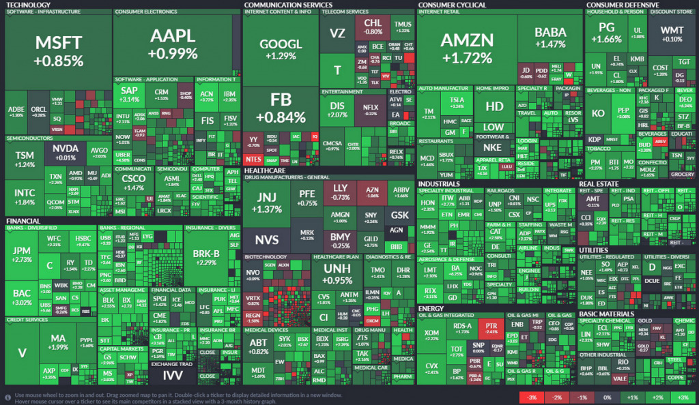
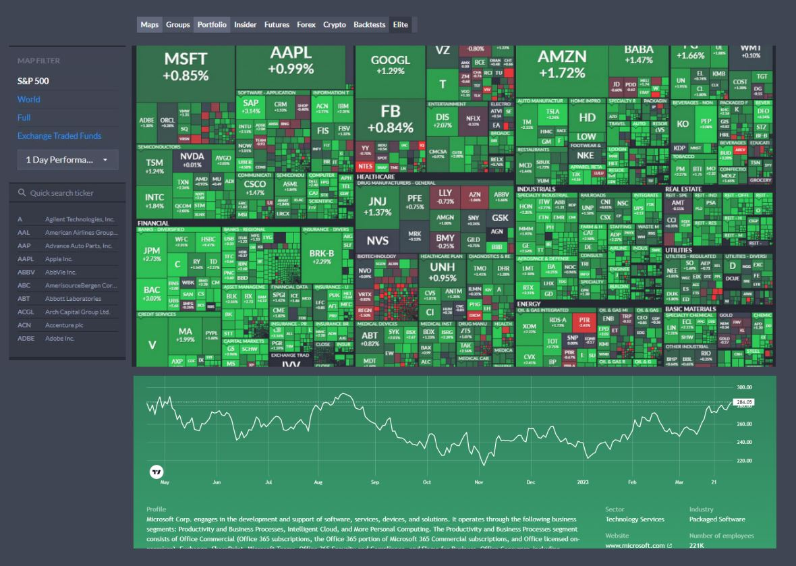
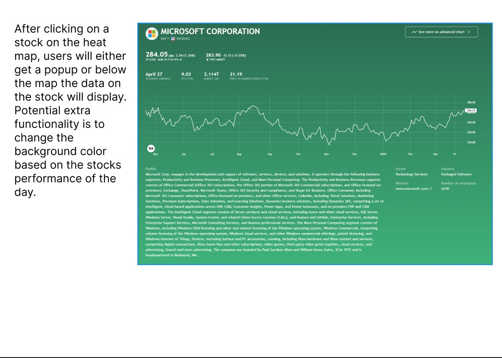
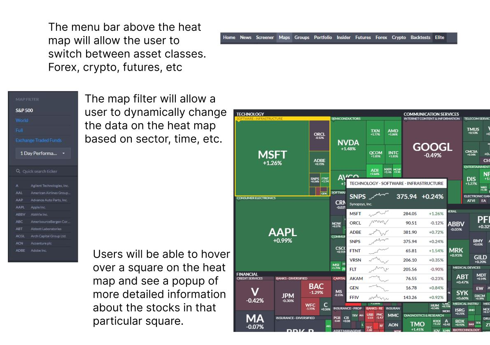

# Stock Heat Map Data Visualization

 

---------------------
## Background

A stock heat map is a visual representation of how various stocks or financial instruments are performing in the market. The map displays a grid of rectangular cells, with each cell representing a particular stock or financial instrument. The cells are colored to indicate the performance of the stock or instrument, with brighter or darker colors indicating better or worse performance, respectively.

Stock heat maps typically have two levels of hierarchy. The first level represents the sector-wise heatmap, where stocks are grouped based on their respective sectors. The second level represents the heatmap of individual stocks within the sector.

The heat map is generated using two key parameters. The color of the cell is determined by the gain or loss of the stock or instrument during a particular period, such as a trading day or week. The size of the cell can be used to represent a related metric, such as the market capitalization of the stock or instrument.

Stock heat maps are useful for identifying trends and patterns in the market quickly and efficiently. They can help traders and investors to make informed decisions about buying and selling stocks and to keep track of their portfolios.

Examples can be viewed here:
- Finviz https://finviz.com/map.ashx
- Trading View https://www.tradingview.com/heatmap/stock/?color=change&dataset=SPX500&group=sector&size=market_cap_basic

---------------------
## Functionality & MVPs

### In the Stock Heat Map, users can interact with

- **Stock data aggregation:** The heat map should be able to aggregate stock data by sector, industry, or any other relevant category.
- **Interactive filtering and sorting:** The heat map should allow users to filter and sort the data based on various criteria, such as price, volume, gain/loss, and market cap.
- **Color-coded cells:** Each cell in the heat map should be color-coded based on the stock's performance, with different shades of color representing different levels of performance.
- **Drill-down functionality:** Users should be able to click on a particular sector or stock to drill down and see more detailed information about it.
- **Tooltips:** Tooltips can provide additional information about each cell upon hovering, such as the stock's name, price, and change.
- **Zooming and panning:** The heat map should allow users to zoom in and out and pan across the data to view different parts of the heat map.
- **Responsiveness:** The heat map should be responsive and adaptable to different screen sizes and devices.

### In addition, this project will include:

- Nav links include links to this project's Github repo, my LinkedIn
- Instructions
- A production README

---------------------
## Wireframe

### Example rendering of the final webpage layout:

### Example rendering of the details shown when a user clicks on a particular stock:

### Other key functionality:

---------------------
## Technologies, Libraries, APIs

- **JavaScript:** The core programming language used to create the heat map.
- **HTML/CSS:** The markup and styling languages used to create the user interface of the heat map.
- **Charting libraries:** Used for creating the stock heat map include D3.js, Highcharts, Chart.js, and Plotly. Example here: https://observablehq.com/@d3/treemap
- **Financial data APIs:** APIs such as Alpha Vantage https://www.alphavantage.co/#page-top, Yahoo Finance, and Finnhub can be used to fetch real-time stock market data. *I have tested alpha vantage and it works to pull data.*
- **JavaScript Vanilla DOM API:** A popular JavaScript library that simplifies DOM manipulation and event handling.
- **Webpack and Babel:** To bundle and transpile the source JavaScript code.
- **NPM:** to manage project dependencies.
- **Bootstrap:** A front-end framework that provides a responsive grid system and UI components for building user interfaces.

---------------------
## Implementation Timeline

- **Friday Afternoon & Weekend** - *Data collection, preparation, design, and prototyping:*
    - Collect and prepare the necessary data for the heat map, such as stock prices, volume, and other relevant information.
    - Design the layout and the interface of the heat map and create a prototype.

- **Monday** - *Implementing the basic functionality:*
    - Implement the basic functionality of the heat map, such as loading data, plotting the grid, and setting the color scheme for each cell.

- **Tuesday** - *Adding advanced features:*
    - Add more advanced features to the heat map, such as zooming, filtering, and sorting capabilities.

- **Wednesday** - *Testing, debugging, and optimization:*
    - Test the heat map thoroughly and debug any issues that may arise. Optimize the heat map for performance, and make any necessary adjustments based on user feedback.

- **Thursday Morning** - *Deployment:*
    - Deploy it to GitHub pages

---------------------
***© Christopher Banas***
