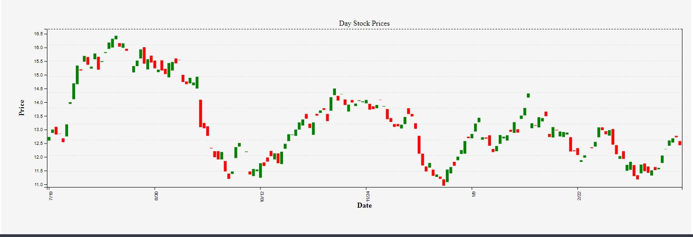
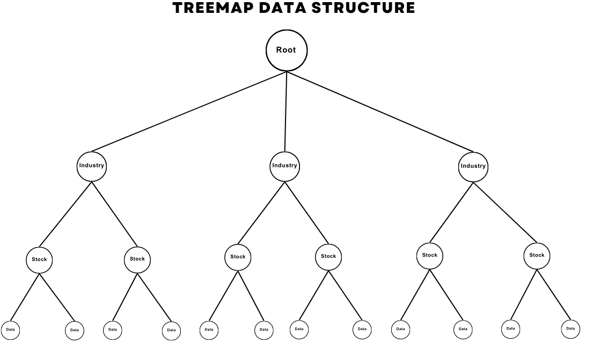

# [Trader Radar](https://chrisbanas.github.io/trader_radar/)

 

---------------------
## Background

Trader Radar is a visual representation of how various stocks or financial instruments are performing in the market.

The map displays a grid of rectangular cells, with each cell representing a particular stock or financial instrument. The cells are colored to indicate the performance of the stock or instrument, with brighter or darker colors indicating better or worse performance, respectively.

Stock heat maps typically have two levels of hierarchy. The first level represents the sector-wise heatmap, where stocks are grouped based on their respective sectors. The second level represents the heatmap of individual stocks within the sector.

The heat map is generated using two key parameters. The color of the cell is determined by the gain or loss of the stock or instrument during a particular period, such as a trading day or week. The size of the cell can be used to represent a related metric, such as the market capitalization of the stock or instrument.

Stock heat maps are useful for identifying trends and patterns in the market quickly and efficiently. They can help traders and investors to make informed decisions about buying and selling stocks and to keep track of their portfolios.

---------------------
## Chart Design

### Treemap

The heat map is designed using a treemap algorithm which was first introduced by [Ben Shneiderman](https://www.cs.umd.edu/hcil/treemap-history/), in the 1990s. A treemap is a visualization technique used to display hierarchical data in a rectangular space. It works by recursively subdividing the available space into rectangles, where each rectangle represents a node in the hierarchy.

The size of each rectangle is proportional to a numeric value associated with the node, in Trader Radars case the user can select from Market Cap, Shares Outstanding, Volume, and Average Volume. The rectangles are colored on a scale from daily percentage changes of -3% to 3% with a color matrix of dark red to bright green to represent different categories or values associated with the nodes.

The treemap displays information in a compact and intuitive way, allowing users to quickly understand the relative size and distribution of the stock to others. In financial analysis, it can be used to visualize market trends and stock performance.


### Candle Stick Chart

The chart shows the daily low, high, open, and close of a stock. Each “candle” represents a single trading day. A specialized x-axis is used to avoid gaps on the weekend when the markets are closed.

Each candlestick is composed of a body and two wicks, or shadows, which represent the opening, closing, high, and low prices of the asset during that time period. The body of the candlestick represents the opening and closing prices, while the wicks represent the high and low prices.

Candlestick charts are useful because they allow traders to quickly and easily visualize price movements and identify trends, patterns, and potential changes in market sentiment. They can also help traders identify potential support and resistance levels, which can be useful for making trading decisions.



---------------------
## Data Structure
The data for the treemap is structured with a root node, then child nodes of the stock industry, then those have child nodes with each stock, and then those have child nodes with the stock information.

In my code snippit below the first function, ```fetchStockData(indexValue)```, is an asynchronous function that fetches data from an external API using the ```fetch()``` method. It takes a single argument, ```indexValue```, which is used to construct the URL for the API request. The function makes two API calls to retrieve data: first, it retrieves a list of stock symbols that are constituents of the specified index ```(indexData)```; second, it retrieves quotes data for all of the symbols retrieved in the first API call ```(quotesData)```. The function then maps through the ```indexData``` array to create an object ```(stockDataMap)``` that contains the stock data for each symbol, using the data retrieved in the ```quotesData``` array. The function then returns an array of the values of this object, using the ```Object.values()``` method.

The second function, ```getStockTreeMapRoot(stockDataArray)```, takes an array of stock data objects as an argument ```(stockDataArray)```. The function creates a root object ```(root)``` with a name property of ```"stock"``` and an empty children array. The function then iterates through each object in ```stockDataArray``` and groups the objects by sector, creating a new object for each unique sector and pushing each stock object to the corresponding sector's children array. Finally, the function adds each sector object to the children array of the root object, and returns the root object.

Together, these functions are used to fetch and process stock data from the API, and then create a hierarchical data structure suitable for displaying the data in the treemap visualization.

```js
// function to fetch stock data
async function fetchStockData(indexValue) {
  const indexData = await fetch(`https://financialmodelingprep.com/api/v3/${indexValue}_constituent?apikey=${apiKey}`)
    .then(response => response.json());
  const symbols = indexData.map(stock => stock.symbol).join(',');
  const quotesData = await fetch(`https://financialmodelingprep.com/api/v3/quote/${symbols}?apikey=${apiKey}`)
    .then(response => response.json());
  const stockDataMap = {};
  indexData.forEach(stock => {
    stockDataMap[stock.symbol] = {
      name: stock.symbol,
      sector: stock.sector,
      fullName: stock.name,
      subSector: stock.subSector,
      marketCap: quotesData.find(quote => quote.symbol === stock.symbol).marketCap,
      changesPercentage: quotesData.find(quote => quote.symbol === stock.symbol).changesPercentage
    };
  });
  return Object.values(stockDataMap);
}

// function to get stock root for treemap
function getStockTreeMapRoot(stockDataArray) {
  const root = {
    name: "stock",
    children: []
  };
  const sectors = {};
  stockDataArray.forEach(stock => {
    const sector = stock.sector;
    if (!sectors[sector]) {
      sectors[sector] = {
        name: sector,
        children: []
      };
    }
    sectors[sector].children.push(stock);
  });
  Object.values(sectors).forEach(sector => {
    root.children.push(sector);
  });
  return root;
}
```




---------------------
## Functionality

### In the Stock Heat Map, users can interact with

- **Interactive filtering and sorting:** The heat map should allow users to filter and sort the data based on various criteria, such as price, volume, gain/loss, and market cap.
- **Color-coded cells:** Each cell in the heat map should be color-coded based on the stock's performance, with different shades of color representing different levels of performance.
- **Stock data aggregation:** The heat map should be able to aggregate stock data by sector, industry, or any other relevant category.
- **Zooming and panning:** The heat map should allow users to zoom in and out and pan across the data to view different parts of the heat map.

- **Drill-down functionality:** Users should be able to click on a particular sector or stock to drill down and see more detailed information about it.
- **Tooltips:** Tooltips can provide additional information about each cell upon hovering, such as the stock's name, price, and change.

- **Responsiveness:** The heat map should be responsive and adaptable to different screen sizes and devices.

### In the Stock Info Page, users can interact with


---------------------
## Technologies, Libraries, APIs

- **JavaScript:** The core programming language used to create Trader Radar.
- **HTML/CSS:** The markup and styling languages used to create the user interface of the heat map.
- **Charting libraries:** Used for creating the stock heat map and candle stick char from [D3](https://d3js.org/)
    - [D3 Treemap](https://observablehq.com/@d3/treemap)
    - [D3 Candle Stick Chart](https://observablehq.com/@d3/candlestick-chart)
- **Financial data APIs:** API data from [Financial Modeling Prep](https://site.financialmodelingprep.com/developer/docs/)
    - [List of S&P 500 Companies](https://site.financialmodelingprep.com/developer/docs/list-of-sp-500-companies-api/)
    - [List of Dow Jones Companies](https://site.financialmodelingprep.com/developer/docs/list-of-nasdaq-companies-api/)
    - [List of NASDAQ Companies](https://site.financialmodelingprep.com/developer/docs/list-of-dow-companies-api/)
    - [Current Stock Data](https://site.financialmodelingprep.com/developer/docs/stock-api/)
    - [Companiy Stats](https://site.financialmodelingprep.com/developer/docs/companies-key-stats-free-api/)
    - [Stock News](https://site.financialmodelingprep.com/developer/docs/stock-news-api/)
    - [Historical Stock Data](https://site.financialmodelingprep.com/developer/docs/historical-stock-data-free-api/#Historical-Daily-Prices)
- **Public Holiday API**
    - [Nager](https://date.nager.at/Api)
- **Google Fonts**
- **Font Awesome**
- **JavaScript Vanilla DOM API:** A popular JavaScript library that simplifies DOM manipulation and event handling.
- **Webpack and Babel:** To bundle and transpile the source JavaScript code.
- **NPM:** to manage project dependencies.
- **Bootstrap:** A front-end framework that provides a responsive grid system and UI components for building user interfaces.

---------------------
***© Christopher Banas***
